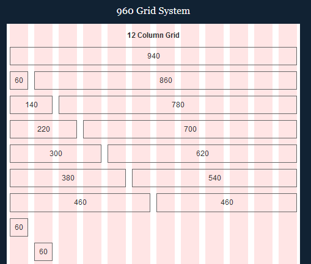
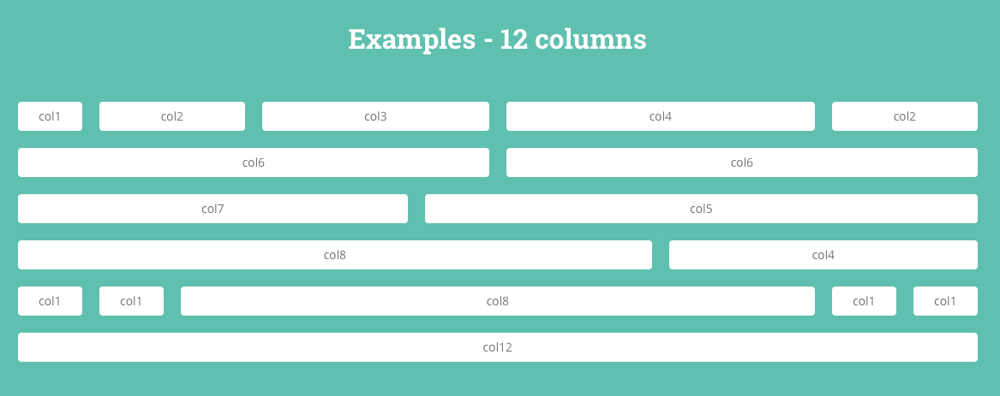

# Введение

На сегодняшний день требования при создании современных веб-сайтов намного более жестче, нежели раньше. Сегодня необходимо создавать веб-сайты на основе разметки, которая обеспечивает работу с потенциально неограниченным количеством областей просмотра на всех типах устройств.

Вторая проблема, с которой приходится сталкиваться в современном мире веб-разработки, состоит в том, что создание сайтов должно выполняться быстро. Очень быстро. Традиционные системы создания разметки помогают с быстрым стартом при разработке проекта. Однако такие системы трудно поддаются изменениям под конкретные условия, что приводит к созданию чрезмерно раздутого кода, который не используется даже на 90%.

В итоге для веб-разработки необходимо иметь легкую в использовании, гибкую, удобную в изменении систему для прототипирования.

Susy отвечает всем этим требованиям.

## Что такое Susy?

Чтобы ответить на этот вопрос, мы должны сначала ответить на вопрос: "Что такое сетка?".

Сетка в веб-терминологии - не что иное, как ряд вертикальных колонок, расположенных на странице сверху вниз. Сетки пришли в веб-разработку из полиграфического дизайна и теперь используются веб-дизайнерами каждый день при создании сайтов, для организации и представления информации на странице в упорядоченном виде.

Эти вертикальные колонки помогают разделить веб-страницу на два вида вертикальных полос. Более широкие полосы называются _столбцами_ (columns), а более узкие полосы - _канавками_ (gutters). Порядок и расположение элементов на веб-странице называется _разметкой страницы_ (layout).

Системы построения разметки существовали задолго то того, как сайты в Интернете стали мобильными и адаптивными. Вы можете даже сами узнать их присутствие на странице в некоторых случаях самостоятельно!

Изначально система построения разметки 960 grid system (960gs) являлась стандартом в веб-дизайне и практически все сайты того времени создавались на основе такой сетки. Это было время, когда был только один распространенный размер монитора - с шириной 1024px.

Немного позже на рынке появились мониторы большего размера (1280px) и веб-разработчики начинали переключаться на систему сеток (grid system) 1140px.

Поскольку технологии не стоят на месте и мобильные устройства постепенно стали самым распространенным способом серфинга в Интернет, фреймворки для создания адаптивных сеток, такие как Bootstrap и Foundation стали чрезвычайно популярными. Они были очень полезны в течение долгого времени. Эти фреймворки отвечали задачам поддержки наиболее популярных в то время устройств, таких как iPhone3, iPhone4, iPad, а также популярный размер для настольных систем 1280px.

Однако, даже такие фреймворки как Bootstrap и Foundation перестают полностью отвечать свои задачам, когда дело касается разработки веб-сайтов по современным стандартам. Сегодня на рынке имеется бесконечное число различных типов устройств и больше нельзя разрабатывать сайты только для выборочного их количества; и при этом надеяться, что веб-сайт все еще будет отвечать всем современным стандартам.

В наши дни, когда буквально каждый пользователь Интернет имеет свой собственный сайт, разработчики все время пытаются создавать новые и уникальные проекты. Некоторые из этих проектов используют сетки с неравными ширинами и традиционные фреймворки Bootstrap и Foundation не имеют возможности полностью отвечать всем требованиям в полной мере.

Вот почему появилась такая система, как Susy.

Susy - это движок для создания разметки (layout) страницы. Он предоставляет инструменты для создания своей собственной сетки (grid system), которая будет соответствовать потребностям конкретного веб-сайта в каждом конкретном случае. Благодаря Susy появляется гибкость и свобода действий в веб-разработке.

## Почему Susy?

Итак, почему Вы должны потратить часть своего драгоценного времени, чтобы изучить Susy?

Susy существенно отличается от всего того, с чем вы могли иметь дело ранее. Этот движок дает вам полную свободу действий в создании что-либо. Он позволяет раскрыть самого себя и ваш проект, не будучи ограниченным методами, которые утвердились на сегодняшний день в Интернете.

Самая важная вещь для меня заключается в том, что после того, как к вам придет полное понимание работы в Susy, вам никогда больше не понадобиться обращаться к документации по этому движку. Процесс разработки при этом ускориться во много раз.

Susy может стать идеальным инструментом, который позволяет создавать систему сеток (grid system) для каждого конкретного случая. Почему бы нет? Так как Susy очень проста в изучении и для этого потребуется всего несколько вечеров или выходных, то почему бы вам не испытать себя и узнать что-либо новое?

Хорошая новость состоит в том, что Susy для своей работы требует только наличия в системе Sass, отличного препроцессора, который на сегодняшний день используют многие веб-разработчики. Нет никаких дополнительных зависимостей, что означает, что ошибки от зависимостей и версий пакетов сведены к минимуму.

## Почему эта книга?

Susy делает процесс разработки для веб-разработчиков чрезвычайно простым благодаря абстракции большей части CSS. Стилизация с помощью CSS может показаться со стороны достаточно простым делом, но когда разметка страницы ведет себя не так, как от нее ожидалось, задача разобраться в чем проблема становиться не такой уж простой.

Я в течение последних 6 месяцев я учился работать с Susy. Было не всегда легко найти ответы на вопросы и я должен был искать ответы на них из различных источников. Много раз бывало так, что я должен был придумать свои собственные решения для некоторых из этих проблем.

В этой книге я хочу поделиться с вами своим опытом, как с помощью Susy создавать разметку сайта; как начать создание разметки для конкретного случая, если такая задача до сих пор была для вас трудной.

## Для кого эта книга?

Цель этой книги состоит в том, чтобы сделать процесс создания сайтов простым и легким. Даже если вы еще не знакомы с препроцессором Sass, это не помешает вам в дальнейшем изучении.

У Sass есть два различных синтаксиса для работы в нем. В продолжение всей этой книги я буду использовать синтаксис SCSS, потому что я лучше знаком с ним.

Я предполагаю, что у Вас уже есть основные практическое навыки работы в Sass. Если у Вас есть опыт компилирования кода Sass в терминале или специальной утилитой препроцессора, то это будет просто замечательно.

Присылайте мне по электронной почте в zellwk@gmail.com все вопросы, которые касаются Susy или если Вы только хотите сказать мне привет. Я прочитаю и отвечу на каждое письмо.

